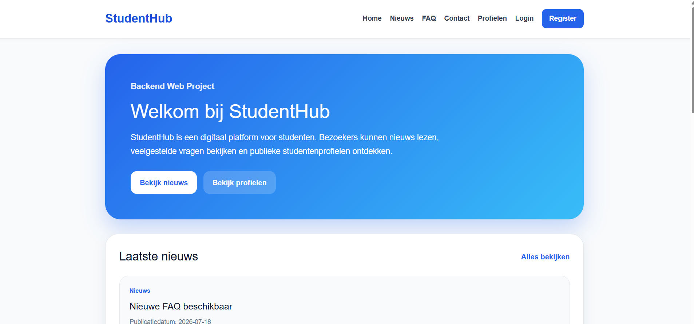
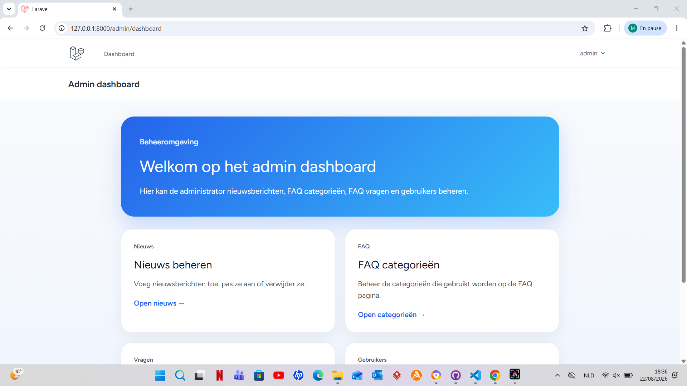
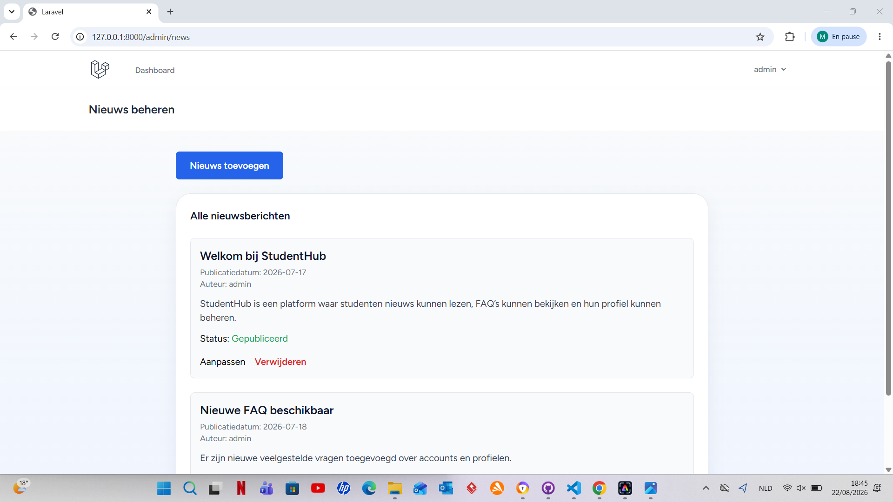
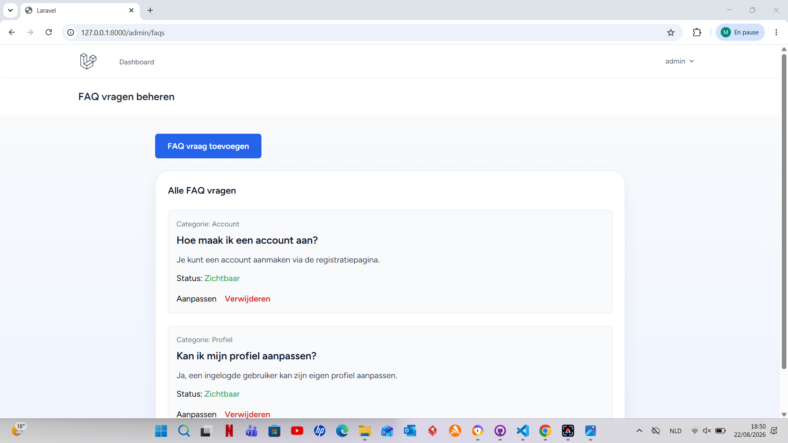

# Backend Web

## StudentHub

StudentHub is mijn project voor het vak Backend Web.

Het is een digitaal platform voor studenten, gemaakt met Laravel.

Op de website kunnen bezoekers nieuwsberichten lezen, FAQ’s bekijken, contact opnemen en publieke studentenprofielen bekijken. Gebruikers kunnen zich registreren, inloggen en hun eigen profiel aanpassen. Een administrator kan de inhoud van de website beheren.

## Wat kan je doen op de website?

- Nieuwsberichten bekijken
- FAQ’s bekijken per categorie
- Een contactformulier invullen
- Publieke studentenprofielen bekijken
- Registreren en inloggen
- Eigen profiel aanpassen
- Als admin nieuws beheren
- Als admin FAQ categorieën en vragen beheren
- Als admin gebruikers beheren
- Als admin rechten geven of verwijderen

## Technische onderdelen

Voor dit project heb ik gewerkt met Laravel en de MVC-structuur.

Ik heb gebruikgemaakt van:

- routes
- controllers
- models
- Blade views
- migrations
- seeders
- Eloquent relaties
- middleware
- validatie
- Laravel Breeze voor authenticatie

Het project bevat ook verschillende relaties tussen tabellen, zoals gebruikers met profielen, FAQ categorieën met vragen en gebruikers met interesses.

## Implementatie van de technische vereisten

Hieronder staat waar de belangrijkste technische vereisten in het project zijn geïmplementeerd.

### Authenticatie en gebruikersrollen

- Registreren en inloggen gebeurt met Laravel Breeze.
- Gebruikersbeheer: `app/Http/Controllers/Admin/UserController.php`
- Het project gebruikt de rollen `user` en `admin`.
- Adminpagina's worden beschermd met middleware.
- `database/seeders/DatabaseSeeder.php` roept `AdminUserSeeder` en `StudentHubSeeder` aan.

### Gebruikersrollen en beheer

De rollen `user` en `admin` worden beheerd in:

`app/Http/Controllers/Admin/UserController.php`

Belangrijke lijnen:

- lijn 69: valideert dat de rol alleen `user` of `admin` kan zijn
- lijn 72: voorkomt dat een admin zijn eigen adminrechten verwijdert
- lijn 77: past de gegevens en rol van de gebruiker aan

### Admin account en seeder

Het standaard adminaccount wordt aangemaakt in:

`database/seeders/AdminUserSeeder.php`

Belangrijke lijnen:

- lijn 15: `User::create([...])`
- lijn 16: admin e-mail `admin@ehb.be`
- lijn 17: wachtwoord wordt beveiligd met `Hash::make(...)`
- lijn 18: rol wordt ingesteld op `admin`
- lijn 21: `Profile::create([...])` maakt automatisch het profiel van de admin aan

`database/seeders/DatabaseSeeder.php` start deze seeder via `AdminUserSeeder::class`.

### Gebruikers en profielen

- Gebruikers worden beheerd via het `User` model.
- Profielgegevens worden beheerd via het `Profile` model.
- Elke gebruiker heeft een eigen profiel.
- Publieke profielen kunnen ook bekeken worden door bezoekers die niet ingelogd zijn.
- Een gebruiker kan zijn eigen profielgegevens aanpassen en een profielfoto uploaden.

### Nieuws

- Model: `app/Models/NewsItem.php`
- Controller: `app/Http/Controllers/Admin/NewsItemController.php`
- Bezoekers kunnen nieuwsberichten en een detailpagina per nieuwsbericht bekijken.
- Een admin kan nieuwsberichten toevoegen, aanpassen en verwijderen.
- Een nieuwsbericht bevat een titel, afbeelding, inhoud en publicatiedatum.
- Afbeeldingen worden opgeslagen in `storage/app/public/news`.

Belangrijke lijnen in `NewsItemController.php`:

- lijn 27: `store()` verwerkt het toevoegen van een nieuwsbericht
- lijn 56: `update()` verwerkt het aanpassen van een nieuwsbericht
- lijn 76: `store('news', 'public')` slaat een geüploade afbeelding op
- lijn 91: `destroy()` verwijdert een nieuwsbericht

### FAQ

- FAQ's zijn georganiseerd per categorie.
- Een FAQ categorie kan meerdere vragen bevatten.
- Een admin kan FAQ categorieën toevoegen, aanpassen en verwijderen.
- Een admin kan FAQ vragen en antwoorden toevoegen, aanpassen en verwijderen.
- Een FAQ vraag kan zichtbaar of niet zichtbaar worden gemaakt.

Belangrijke lijnen in `FaqCategoryController.php`:

- lijn 27: `store()` maakt een nieuwe FAQ categorie aan
- lijn 54: `update()` past een FAQ categorie aan
- lijn 60: `destroy()` verwijdert een FAQ categorie

Belangrijke lijnen in `FaqController.php`:

- lijn 32: `store()` maakt een nieuwe FAQ vraag en antwoord aan
- lijn 61: `update()` past een bestaande FAQ vraag aan
- lijn 80: `destroy()` verwijdert een FAQ vraag

### Eloquent relaties

Het project gebruikt verschillende relaties tussen de modellen:

- User ↔ Profile
- FAQ categorie → FAQ vragen
- User ↔ Interests

Hierdoor worden gerelateerde gegevens via Eloquent met elkaar verbonden.

### Migrations en seeders

De databasestructuur wordt opgebouwd met Laravel migrations.

Met:

`php artisan migrate:fresh --seed`

worden de tabellen opnieuw aangemaakt en worden de standaardgegevens toegevoegd.

De werking van deze opdracht werd lokaal getest. De migrations en seeders werden succesvol uitgevoerd.

### Validatie en beveiliging

Formuliergegevens worden aan de serverzijde gevalideerd met Laravel.

Voorbeelden:

- verplichte velden met `required`
- controle van e-mailadressen met `email`
- unieke e-mailadressen met `unique`
- minimumlengte voor wachtwoorden
- controle van toegelaten rollen (`user` of `admin`)

Laravel Blade en CSRF-bescherming worden gebruikt voor de formulieren.

### Routes en MVC

De applicatie volgt de MVC-structuur van Laravel:

- Models beheren de gegevens.
- Controllers verwerken de logica.
- Blade views tonen de pagina's.
- Routes verbinden URL's met controllers en pagina's.

## Admin account

Na het uitvoeren van de seeders is er een standaard admin account:

```text
Email: admin@ehb.be
Password: Password!321
```

## Installatie

Voer deze commando's uit om het project lokaal te starten:

```bash
composer install
npm install
cp .env.example .env
php artisan key:generate
php artisan migrate:fresh --seed
php artisan storage:link
npm run dev
php artisan serve
```

Daarna kan de website geopend worden via:

```text
http://127.0.0.1:8000
```

## Tools

Tijdens het maken van dit project heb ik deze tools gebruikt:

- Visual Studio Code
- Laravel
- PHP
- Laravel Breeze
- Composer
- NPM
- Blade
- Eloquent
- GitHub
- GitHub Desktop
- Laravel Herd / lokale PHP omgeving

## Gebruik van AI

Ik heb ChatGPT gebruikt als hulpmiddel tijdens het project.

ChatGPT heeft mij geholpen bij het verbeteren van taalfouten, het begrijpen van foutmeldingen en het controleren van de structuur.

De code werd door mij stap voor stap opgebouwd, aangepast, getest en gepusht.

## Bronnen

Voor dit project heb ik gebruikgemaakt van:

- cursusmateriaal Backend Web
- Laravel documentatie
- Laravel Breeze documentatie
- eigen testen tijdens het programmeren
- ChatGPT als ondersteuning voor taalcorrectie en verduidelijking

## Screenshots van de applicatie

### Homepagina



### Admin dashboard



### Nieuwsbeheer



### FAQ beheer



## Auteur

Rania Mohsine